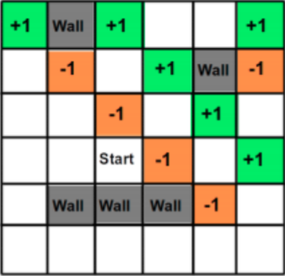
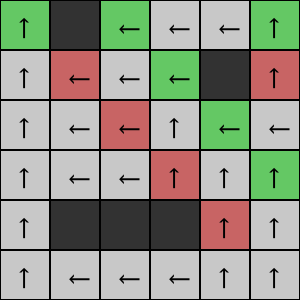
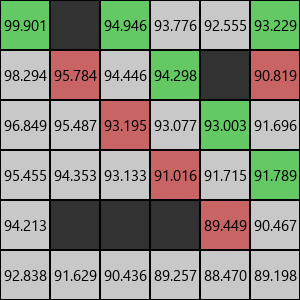
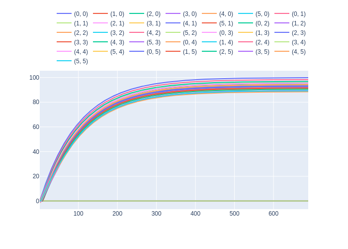
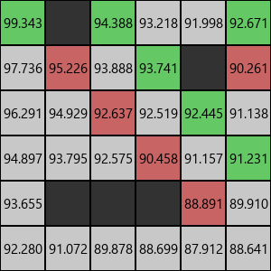
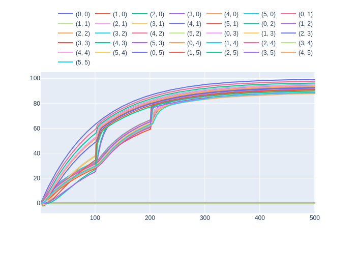

# Markov Decision Process

## Problem Description

<br>
<div align="center">
 </img>
</div>

The maze environment is a 6x6 grid world which contains walls, rewards and penalties.
All green squares have a reward of +1. All orange/red squares have a penalty of -1. All
white squares have a reward of -0.04. All grey squares are walls and these are
unreachable states. Hence the reward for walls need not be defined and has been set
to 0 for this experiment.

<br>
<div align="center">
 </img>
</div>

The transition model is as follows: the intended outcome occurs with probability 0.8, and
with probability 0.1 the agent moves at either right angle to the intended direction. If the
move would make the agent walk into a wall, the agent stays in the same place as
before. The rewards for the white squares are -0.04, for the green squares are +1, and
for the brown squares are -1. Note that there are no terminal states; the agent’s state
sequence is infinite.

<br>
<br>

---

## Note

There is no terminal state. For some reinforcement learning algorithms, the epsiode ends after a certain number of steps.

<br>
---

## Getting Started

### Install Requirements
```bash
pip install -r requirements.txt
```

### Run Code
```bash
python __main__.py --algorithm=value_iteration --display_policy=True --display_utilities=True
```

### Choice of Algorithms

* value_iteration
* policy_iteration
* sarsa
* expected_sarsa
* q_learning
* monte_carlo
* dyna_q

---

## Results

### Value Iteration

#### Policy

<div align="center">
 </img>
</div>

#### Utilities

<div align="center">
 </img>
</div>

#### Plot

<div align="center">
 </img>
</div>

### Policy Iteration

#### Policy

<div align="center">
 </img>
</div>

#### Utilities

<div align="center">
 </img>
</div>

#### Plot

<div align="center">
 </img>
</div>